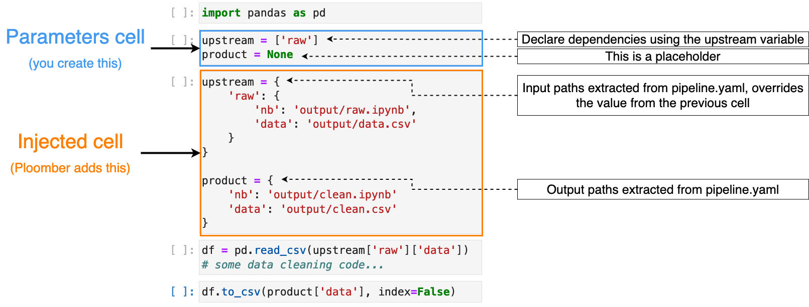
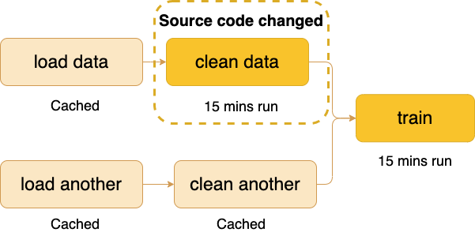
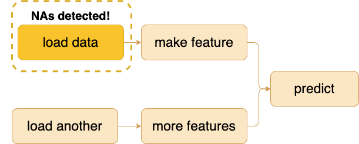
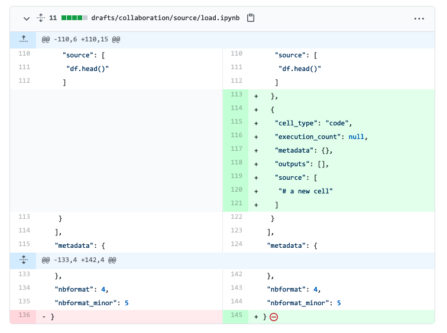
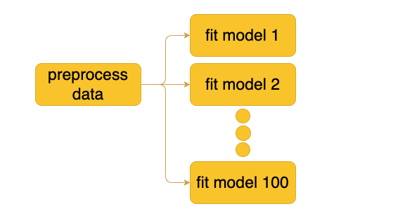

## Block 1: Introduction to Ploomber

8:00 - 9:00

> We'll motivate the project and explain why investing in organizing our project as a modular pipeline (multiple scripts/notebooks) instead of a big script/notebook helps us develop faster and enhances collaboration.

<!-- #region -->
### Before we start...

#### Option 1. Local setup

> **Important:** If you didn't get the chance to confiure your environment locally before the workshop, go to *Option 2*, since it's simpler

Let's check your setup. Run in your terminal:

**Step 1:** Clone the forked repository.

```sh
git clone https://github.com/{USERNAME}/scipy-2022
cd scipy-2022
```

If you already cloned it, [sync it with the original repo.](https://stackoverflow.com/a/65401892/709975)

**Step 2:** Activate your environment.

```sh
# conda
conda activate ploomber-workshop

# pip
source ploomber-workshop/bin/activate
```

**Step 3:** Check your setup.

```sh
python check.py
```

**Step 4:** Start JupyterLab


```sh
jupyter lab
```

#### Option 2. Hosted JupyterLab

To simplify setup, we're offering a hosted JupyterLab.

[Register here](https://docs.ploomber.io/en/latest/cloud/api-key.html). Then, access [JupyterLab here.](https://docs.ploomber.io/en/latest/cloud/guide.html#hosted-jupyterlab)

Once JupyterLab starts:

**Step 1:** Clone the forked repository.

```sh
git clone https://github.com/{USERNAME}/scipy-2022
cd scipy-2022
```

If you already cloned it, [sync it with the original repo.](https://stackoverflow.com/a/65401892/709975)

**Step 2:** Install dependencies.

```sh
# create virtual env
conda create --name ploomber-workshop python=3.9 --yes

# activate env
conda activate ploomber-workshop

# install packages
pip install -r requirements.txt
```

**Step 3:** Check your setup.

```sh
python check.py
```
<!-- #endregion -->

### 1.1 Refactoring a legacy notebook

> We'll demonstrate how to use our open-source tool to convert monolithic notebooks into Ploomber pipelines with one command.

```sh
cd material
soorgeon refactor notebook.ipynb --df-format parquet --file-format py
```

Open [material/pipeline.yaml](material/pipeline.yaml)

```sh
cd material
ploomber plot --backend d3
```

Open [material/pipeline.html](material/pipeline.html)


### 1.2 The `pipeline.yaml` file

> The `pipeline.yaml` file is where we declare the tasks in our pipeline. `soorgeon refactor` generated one for us since we refactored an existing notebook, but if we were to start a project from scratch we'd create it manually:

```sh
from pathlib import Path
from IPython.display import Markdown

def display(path):
    """Utility function to display files
    """
    path = Path(path)
    content = path.read_text()
    ext = path.suffix[1:]
    return Markdown(f'```{ext}\n# content of {str(path)}\n\n{content}\n```')

display('material/pipeline.yaml')
```


### 1.3 The command-line interface

> We introduce the command-line interface, which allows us to manage our pipeline: execute the workflow fully or partially, generate a pipeline diagram, and check the status.

```sh
ploomber --help
```

```sh
cd material
ploomber build
```

```sh
cd material/output
ls
```

We can also use the Python API (it updates in real time!):

```sh
from ploomber.spec import DAGSpec

dag = DAGSpec('material/pipeline.yaml').to_dag()
dag.build(force=True)
```

Most commands in the CLI have an equivalent method in the Python API:

```sh
cd material
ploomber status
```

```sh
dag.status()
```

<!-- #region -->
### 1.3 Using Ploomber from JupyterLab, VSCode or PyCharm

> We'll show how practitioners can use Ploomber from your favorite text editor.

**JupyterLab:**

No need to do anything else, the plugin is automatically installed and configured. `.py` files should open as notebooks automatically, if they don't, right click on them and click on *Open with Notebook*:


[Documentation](https://docs.ploomber.io/en/latest/user-guide/jupyter.html)

**Other editors (VSCode, PyCharm, Spyder)**

Run this to inject the cell manually (and run it again if you modify your `pipeline.yaml`):

```sh
ploomber nb --inject
```

[Documentation](https://docs.ploomber.io/en/latest/user-guide/editors.html)



### 1.4 Pipeline parametrization

> We introduce the concept of parametrization, which allows us to run our pipeline with different parameters. Parametrization helps us apply the same analysis to additional data to organize our experiments.

Static `param`:

```yaml
# content of pipeline.yaml

- source: tasks/load.py
  product:
    df: output/load-df.parquet
    nb: output/load.ipynb
  params:
    sample: true
```

**Exercise 1:** Modify `material/pipeline.yaml` and add a parameter to the `material/tasks/load.py` notebook (under the `params` section), then add a new cell to the notebook to print the value of the parameter. Then, execute the following and check if the output notebook (`material/output/load.ipynb`) prints the right value:
<!-- #endregion -->

```sh
cd material
ploomber build
```

<!-- #region -->
Convert `param` into a placeholder:

```yaml
# content of pipeline.yaml

- source: tasks/load.py
  product:
    df: output/load-df.parquet
    nb: output/load.ipynb
  params:
    sample: '{{sample}}'
```

Add `env.yaml`:


```yaml
# content of env.yaml

sample: true
```

**Exercise 2:** Convert `sample` into a placeholder, then create an `env.yaml` file, declare the `sample` parameter there. And check that the notebook runs:
<!-- #endregion -->

```sh
cd material
ploomber task load --force
```

```sh
cd material
ploomber task --env-sample false
```

<!-- #region -->
## 10-minute break

9:00 - 9:10

## Block 2: Advanced features

9:10 - 10:10

### 2.1 Adding new tasks

> We demonstrate how to add new tasks to our existing pipeline and establish the dependency relations among tasks.

```yaml
- source: {path/to/source}
  product:
    nb: {path/to/notebook}
    {key}: {path/to/output}
    ...
```

```sh
ploomber scaffold
```

**Exercise 3**: Add a new `tasks/fit.py` notebook, then execute `ploomber scaffold` (inside the `material` directory) to create the notebook. Finally, add the code from `tasks/linear-regression.py`.

### 2.2 Incremental builds

>  Data analysis is an iterative process, and we often make small changes and rerun the code to see how that affects our results. We'll show how incremental builds allow users to run more experiments faster by caching previous results.



**Exercise 4**: Add a print statement to `tasks/fit.py` (or any other task) and execute `ploomber build`. Verify that only that task (and any downstream) ones are executed.

### 2.3 Adding data quality tests

> Here we improve our testing strategy. We demonstrate how to use Ploomber to add data quality tests to each task in our pipeline. These tests serve as sanity checks to ensure each output produces high-quality data.



Example:

```yaml
# content of pipeline.yaml

- source: tasks/load.py
  product:
    nb: output/load.ipynb    
  on_finish: data_quality.no_nas
```

Data quality test:

```python
# content of data_quality.py
import pandas as pd

def no_nas(product):
    df = pd.read_parquet(product['df'])

    assert not df.MedHouseVal.isna().sum()
```

**Exercise 5:** Add a `data_quality.py` to check that the output of the `tasks/load.py` notebook does not contain NAs in the `MedHouseVal` column.

### 2.4 Debugging

> This section will show Ploomber's debugging capabilities, which allows us to debug our pipelines when they fail.

[Documentation](https://docs.ploomber.io/en/latest/user-guide/debugging.html)

**Exercise:** Add the following cell at the end of the `material/tasks/load.py` file:

```python
def divide(x, y):
    return x / y

divide(1, 0)
```

Then execute (this will crash):
<!-- #endregion -->

```sh
ploomber build
```

<!-- #region -->
You'll be able to look at the crashed notebook at `material/output/load.ipynb`

To debug interactively, run the following in a terminal:

```sh
ploomber interact
```

Once it loads:


```python
dag['load'].debug()
```
<!-- #endregion -->

<!-- #region -->
### 10-minute break

10:10 - 10:20

## Block 3: Collaboration

10:20 - 11:05

### 3.1 Using GitHub Actions for smoke testing

> We'll demonstrate a simple setup to enhance collaboration using GitHub Action, a free tool that will automate code testing, so we know if we broke anything.

```yaml
# content of .github/workflows/testing.yaml

name: Test

on: [push, pull_request]

jobs:
  smoke-test:
    runs-on: ubuntu-latest

    steps:
      - uses: actions/checkout@v2
      - name: Set up Python
        uses: actions/setup-python@v2
        with:
          python-version: 3.9
      - name: Install dependencies
        run: |
          pip install -r requirements.txt
      - name: Unit tests
        run: |
          cd material
          ploomber build --env--sample true
```

**Exercise 6:** Add the contents of the code snippet above to `.github/workflows/testing.yaml`, and push to GitHub, then check that your pipeline passes.

### 3.2 Collaboration using Pull Requests on GitHub

> This section will demonstrate how we can use Pull Requests for asynchronous collaboration.



**Exercise 7:** Create a Pull Request to the original repository.

## 10-minute break

11:05 - 11:15

## Block 4: Scaling Up Experiments

11:15 - 12:00

### 4.1 Running experiments in parallel

> Often we want to run some analysis with the same input data but different parameters. Users typically rely on modules like multiprocessing to achieve this but require a lot of glue code and know-how. We demonstrate how to parallelize experiments in Ploomber, which manages the multiprocessing parts.



```yaml
executor: parallel

tasks:
  # ... more tasks here

- source: tasks/fit.py
  name: fit-
  product:
    nb: output/fit.ipynb
  grid:
    model:
      - sklearn.linear_model.LinearRegression
      - sklearn.svm.SVR
      - sklearn.ensemble.GradientBoostingRegressor
      - sklearn.ensemble.RandomForestRegressor
```

Snippet to initialize models from a string:

```python
import importlib
module_name, _, attribute = model.rpartition('.')
module = importlib.import_module(module_name)
lr = getattr(module, attribute)
```

**Exercise 8:** Switch to the `parallel` executor and create a `tasks/fit.py` task to train many models at the same time.

### 4.2 Execution in distributed environments

> We demonstrate how users can export their local workflows to run in distributed environments. For example, many universities and research institutes have SLURM clusters available. Ploomber can export pipelines to SLURM (and other platforms such as Kubernetes) to scale experiments.

[Documentation](https://soopervisor.readthedocs.io/en/latest/)

Supported platforms (open-source):

* Kubernetes (via Argo Workflows)
* Kubeflow
* SLURM
* Airflow
* AWS Batch

### 4.3 Ploomber Cloud (free tier):

[Instruction to get an API key.](https://docs.ploomber.io/en/latest/cloud/api-key.html)

Store key:

```sh
ploomber cloud set-key {KEY}
```

Run in the cloud:

```sh
ploomber cloud build
```

Check that your pipeline is scheduled:

```sh
ploomber cloud list
```

Check logs:

```sh
ploomber cloud logs {run-id} --image --watch
```

```sh
ploomber cloud logs {run-id} --watch
```

Check task status:

```sh
ploomber cloud status {run-id} --watch
```

Download outputs:

```sh
ploomber cloud download '*'
```

**Exercise 9:** Execute your pipeline in the cloud.
<!-- #endregion -->

## Learn more

* [Documentation](https://docs.ploomber.io/)
* [GitHub repository](https://github.com/ploomber/ploomber) - Please show your support with a ⭐️!
* [Slack Community](https://ploomber.io/community)
